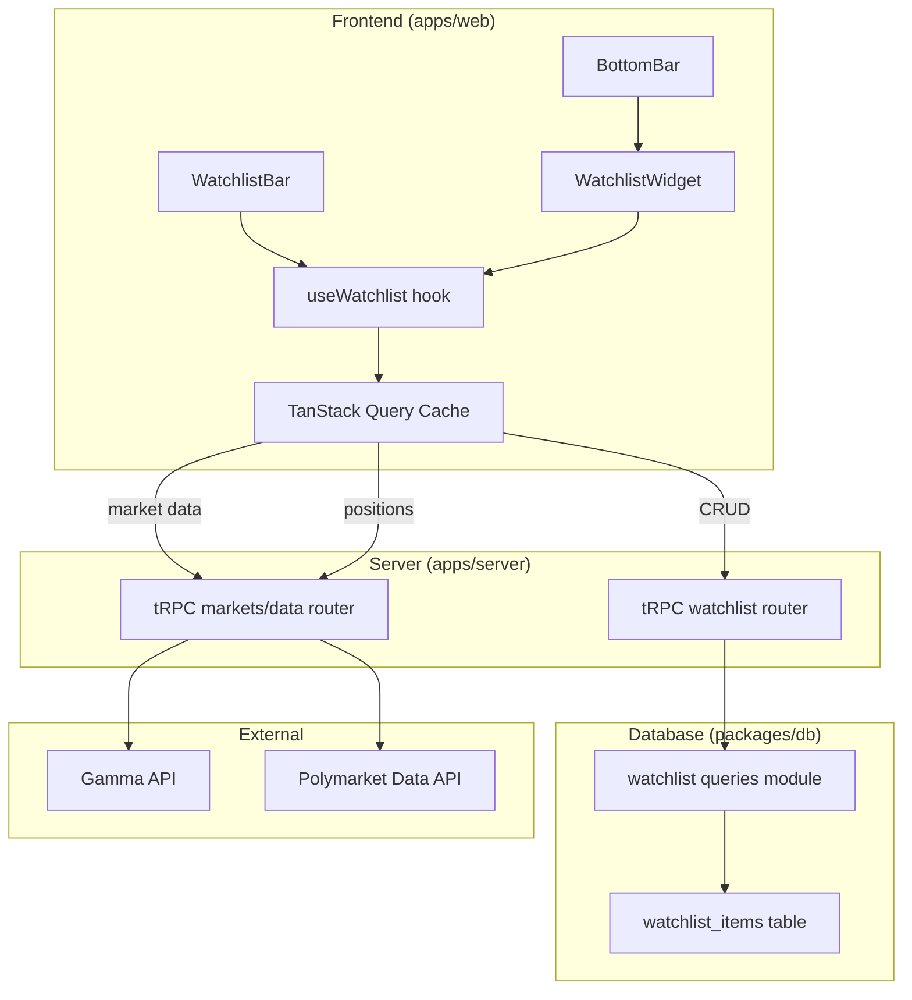

# Design Document: Watchlist System

## Overview

The Watchlist System replaces the current hardcoded `WatchlistProvider` (client-side state with mock data) with a server-persisted, user-scoped watchlist backed by PostgreSQL via Drizzle ORM. It follows the same DB → queries → tRPC router → TanStack Query pattern established by the wallet tracking feature.

The system has two UI surfaces:
1. **WatchlistBar** — a horizontal strip below the SiteHeader showing watchlisted markets with prices
2. **WatchlistWidget** — a draggable floating panel opened from the BottomBar, following the same pattern as the WalletTrackerWidget

Both surfaces share the same data layer and display logic, supporting two mutually exclusive viewing modes (Position Mode and Favorites Mode), optional position value display, and configurable sort order persisted in localStorage.

### Key Design Decisions

- **Condition ID as the market key**: Watchlist items store the Polymarket `conditionId` (not slug or token ID) because it's the stable onchain identifier used by both the Gamma API and Data API for positions/prices.
- **Server-side toggle**: A single `toggle` mutation handles both add and remove, simplifying the frontend star/unstar interaction to one call.
- **Client-side enrichment**: Market metadata (title, prices, slug) is fetched client-side via Gamma API through the existing tRPC data/markets proxy, keeping the watchlist tRPC router thin (CRUD only).
- **localStorage for display preferences**: Sort order and "show position value" are display-only settings that don't need server persistence — localStorage keeps them fast and avoids unnecessary DB columns.

## Architecture



### Data Flow

1. **On mount**: `useWatchlist` hook calls `watchlist.list` via tRPC to get the user's condition IDs, then fetches market metadata from Gamma and positions from the Data API in parallel.
2. **On toggle**: Frontend calls `watchlist.toggle` mutation → server checks existence → adds or removes → returns result → TanStack Query invalidates the watchlist list cache.
3. **Enrichment**: Market titles, prices, slugs, and icons come from the Gamma API via the existing `markets` tRPC router. Position data comes from `data.positions`. Both are cached with TanStack Query (30s stale time for prices).
4. **Display preferences**: Sort order and position value visibility are read/written to localStorage, applied client-side to the enriched data before rendering.

## Components and Interfaces

### Database Layer (`packages/db`)

**Schema**: `packages/db/src/schema/watchlist-items.ts`
- New `watchlist_items` table following the `tracked_wallets` pattern
- Exports added to `packages/db/src/schema/index.ts`

**Queries**: `packages/db/src/queries/watchlist-items.ts`
- `addWatchlistItem(db, userId, conditionId)` — insert with limit check in transaction
- `removeWatchlistItem(db, userId, conditionId)` — delete by userId + conditionId (idempotent)
- `toggleWatchlistItem(db, userId, conditionId)` — check existence, add or remove, return action
- `listWatchlistItems(db, userId)` — select all for user, ordered by createdAt DESC
- `countWatchlistItems(db, userId)` — count for limit enforcement
- Exported from `packages/db/src/index.ts`

### Server Layer (`apps/server`)

**tRPC Router**: `apps/server/src/routers/watchlist.ts`
- Namespace: `watchlist` in the app router
- Procedures: `add`, `remove`, `toggle`, `list` — all `protectedProcedure`
- Zod input schemas for each procedure
- Error handling: re-throw TRPCError, wrap unexpected errors in INTERNAL_SERVER_ERROR with server-side logging
- Registered in `apps/server/src/routers/index.ts`

### Frontend Layer (`apps/web`)

**Hook**: `apps/web/src/hooks/use-watchlist.ts`
- Replaces `WatchlistProvider` context with a server-backed hook
- Uses `trpc.watchlist.list.queryOptions()` for fetching
- Uses `trpc.watchlist.toggle.mutationOptions()` with cache invalidation
- Exposes: `items`, `isStarred(conditionId)`, `toggle(conditionId)`, `isLoading`
- Fetches market enrichment data (Gamma) and positions (Data API) in parallel
- Merges watchlist items + market data + positions into enriched display items

**WatchlistBar**: `apps/web/src/components/layout/watchlist-bar.tsx`
- Refactored to use `useWatchlist` hook instead of context
- Mode toggles (Position/Favorites) as local state
- Settings dialog with sort selector and position value checkbox
- Display preferences persisted in localStorage
- Horizontal scroll with wheel event handling (existing pattern preserved)
- Click-to-navigate using market slug

**WatchlistWidget**: `apps/web/src/components/watchlist/watchlist-widget.tsx`
- Draggable floating panel following `WalletTrackerWidget` pattern exactly
- Title bar with drag handle, "Watchlist" label, close button
- Renders same enriched market list as WatchlistBar
- Supports mode toggles and position value display
- Escape key closes, click navigates to market page

**BottomBar**: `apps/web/src/components/layout/bottom-bar.tsx`
- Add "Watchlist" button alongside Wallet Tracker and Calendar
- Star icon from lucide-react
- Disabled state when unauthenticated
- Controls WatchlistWidget open/close state

**AppShell**: `apps/web/src/components/layout/app-shell.tsx`
- Remove `WatchlistProvider` wrapper (no longer needed)
- WatchlistBar now self-contained with server-backed hook

### Shared Display Logic

A shared utility module `apps/web/src/components/watchlist/watchlist-utils.ts` will contain:
- `computePositionValue(size, price)` — position size × current price
- `filterByMode(items, mode, positionConditionIds)` — apply Position/Favorites filter
- `sortItems(items, sortBy)` — sort by price/volume/expiration
- Type definitions for enriched watchlist items

## Data Models

### Database Schema: `watchlist_items`

```typescript
// packages/db/src/schema/watchlist-items.ts
import { index, pgTable, text, timestamp, unique, uuid } from "drizzle-orm/pg-core";
import { users } from "./users";

export const watchlistItems = pgTable(
  "watchlist_items",
  {
    id: uuid("id").defaultRandom().primaryKey(),
    userId: uuid("user_id")
      .notNull()
      .references(() => users.id, { onDelete: "cascade" }),
    conditionId: text("condition_id").notNull(),
    createdAt: timestamp("created_at").defaultNow().notNull(),
    updatedAt: timestamp("updated_at").defaultNow().notNull(),
  },
  (table) => [
    unique("watchlist_items_user_condition_unique").on(table.userId, table.conditionId),
    index("watchlist_items_user_id_idx").on(table.userId),
  ]
);
```

### tRPC Input/Output Types

```typescript
// Add input
z.object({ conditionId: z.string().min(1) })

// Remove input
z.object({ conditionId: z.string().min(1) })

// Toggle input
z.object({ conditionId: z.string().min(1) })

// Toggle output
{ action: "added" | "removed", item?: WatchlistItem }

// List output
WatchlistItem[] // { id, userId, conditionId, createdAt, updatedAt }
```

### Enriched Watchlist Item (Frontend)

```typescript
interface EnrichedWatchlistItem {
  id: string;                    // DB record ID
  conditionId: string;           // Polymarket condition ID
  title: string;                 // Market question from Gamma
  slug: string;                  // Market slug for navigation
  eventSlug?: string;            // Event slug
  icon?: string;                 // Market icon URL
  yesPrice: number;              // Current Yes price (0-1)
  noPrice: number;               // Current No price (0-1)
  positionSize?: number;         // User's position size (from Data API)
  positionValue?: number;        // size × price
  createdAt: Date;               // When added to watchlist
}
```

### Display Preferences (localStorage)

```typescript
interface WatchlistPreferences {
  sortBy: "price" | "volume" | "expiration";
  showPositionValue: boolean;
}
// Key: "doji:watchlist-preferences"
```


## Correctness Properties

*A property is a characteristic or behavior that should hold true across all valid executions of a system — essentially, a formal statement about what the system should do. Properties serve as the bridge between human-readable specifications and machine-verifiable correctness guarantees.*

### Property 1: Add returns a complete record

*For any* valid userId and conditionId string, adding a watchlist item should return a record containing all required fields: a UUID `id`, the `userId`, the `conditionId`, and non-null `createdAt` and `updatedAt` timestamps. Listing the user's watchlist should also return items with these same fields.

**Validates: Requirements 1.1, 2.1, 5.2**

### Property 2: Duplicate condition ID prevention

*For any* user and conditionId, if the conditionId is already in the user's watchlist, attempting to add it again should throw a CONFLICT error and the watchlist length should remain unchanged.

**Validates: Requirements 1.2, 2.2**

### Property 3: Watchlist limit enforcement

*For any* user who already has 200 watchlist items, attempting to add another item should throw a FORBIDDEN error and the watchlist count should remain at 200.

**Validates: Requirements 1.4, 2.3**

### Property 4: Remove then absent

*For any* conditionId in a user's watchlist, after removing it, the conditionId should no longer appear in the user's listed watchlist items, and the list length should decrease by one.

**Validates: Requirements 3.1**

### Property 5: Idempotent delete

*For any* conditionId that is NOT in a user's watchlist, calling remove should succeed without error and the watchlist should remain unchanged.

**Validates: Requirements 3.2**

### Property 6: Toggle round trip

*For any* user and conditionId, toggling it once should add it (returning action "added") and toggling it again should remove it (returning action "removed"), restoring the watchlist to its original state.

**Validates: Requirements 4.1, 4.2, 4.3**

### Property 7: List sort order

*For any* N watchlist items added by a user, `listWatchlistItems` should return exactly N records sorted by `createdAt` in descending order (most recent first).

**Validates: Requirements 5.1**

### Property 8: Enrichment completeness

*For any* set of watchlist condition IDs and a corresponding set of Gamma market records, the enrichment merge function should produce items where every item that has a matching market record contains a non-empty `title`, numeric `yesPrice`, numeric `noPrice`, and a `slug`.

**Validates: Requirements 6.1**

### Property 9: Mode filter correctness

*For any* set of enriched watchlist items with varying position sizes, filtering in Position Mode should return only items where `positionSize > 0`, and filtering in Favorites Mode should return all items regardless of position status.

**Validates: Requirements 7.1, 8.1**

### Property 10: Mode mutual exclusivity

*For any* UI state, activating Position Mode should deactivate Favorites Mode, and activating Favorites Mode should deactivate Position Mode. At most one mode can be active at any time.

**Validates: Requirements 7.3, 8.3**

### Property 11: Position value computation

*For any* position size (non-negative number) and current price (number between 0 and 1), `computePositionValue(size, price)` should equal `size * price`. When a market has no position data, the position value should be undefined.

**Validates: Requirements 9.1, 9.3**

### Property 12: Preferences serialization round trip

*For any* valid `WatchlistPreferences` object (sortBy ∈ {"price", "volume", "expiration"}, showPositionValue ∈ {true, false}), serializing to localStorage and deserializing back should produce an equivalent object.

**Validates: Requirements 10.4**

### Property 13: Input validation rejection

*For any* invalid conditionId input (empty string, whitespace-only string), the tRPC procedures should reject with a validation error and not modify the database.

**Validates: Requirements 12.3**

## Error Handling

### Server-Side Errors

| Error Condition | tRPC Code | Message | Behavior |
|---|---|---|---|
| Duplicate conditionId for user | `CONFLICT` | "This market is already in your watchlist" | Caught via Postgres unique violation (code 23505) |
| Watchlist limit (200) exceeded | `FORBIDDEN` | "Maximum of 200 watchlist items reached" | Checked in transaction before insert |
| Unauthenticated request | `UNAUTHORIZED` | (from protectedProcedure middleware) | Automatic via auth middleware |
| Invalid input (Zod) | `BAD_REQUEST` | Zod validation message | Automatic via tRPC input validation |
| Unexpected DB error | `INTERNAL_SERVER_ERROR` | "An unexpected error occurred" | Logged server-side with full error, generic message to client |

### Client-Side Error Handling

- **Gamma API failure**: Enrichment is best-effort. If Gamma fails for some condition IDs, display items without metadata (show conditionId as fallback title). Items that fail enrichment are omitted from display.
- **Data API failure (positions)**: Position data is optional. If positions fail to load, display items without position values and disable Position Mode.
- **tRPC mutation failure**: Show toast notification with error message. Optimistic updates are NOT used — wait for server confirmation to avoid inconsistent state.
- **Network offline**: TanStack Query retry logic handles transient failures. Stale data remains visible from cache.

## Testing Strategy

### Property-Based Testing

**Library**: `fast-check` (already available in the project via vitest)

Each correctness property maps to a single property-based test with minimum 100 iterations. Tests are tagged with the format: `Feature: watchlist-system, Property {N}: {title}`.

**Test Files**:

1. `tests/unit/watchlist/watchlist-queries.test.ts` — Properties 1–7 (DB query layer)
   - Requires database connection (integration tests, skip if no DB)
   - Uses `fast-check` arbitraries for conditionId generation (hex strings)
   - Follows the exact pattern from `tests/unit/wallet-tracking/tracked-wallets-queries.test.ts`

2. `tests/unit/watchlist/watchlist-utils.test.ts` — Properties 8–12 (frontend utilities)
   - Pure function tests, no DB required
   - Tests enrichment merge, mode filtering, position value computation, preferences serialization
   - Uses `fast-check` arbitraries for generating enriched items, prices, sizes

3. `tests/unit/watchlist/watchlist-validation.test.ts` — Property 13 (input validation)
   - Tests Zod schema validation with generated invalid inputs

### Unit Tests

Unit tests complement property tests for specific examples and edge cases:

- **Edge cases**: Empty watchlist list, single item, exactly 200 items (boundary)
- **Enrichment edge cases**: Gamma returns partial data, missing fields, empty response
- **Mode edge cases**: No positions in any market (Position Mode empty state), all items have positions
- **Unauthenticated state**: Verify disabled UI state, no API calls made
- **Position value edge cases**: Zero size, zero price, very large values

### Test Configuration

```typescript
// fast-check settings for all property tests
{ numRuns: 100 }
```

All property tests reference their design document property via comment tag:
```typescript
// Feature: watchlist-system, Property 1: Add returns a complete record
```
